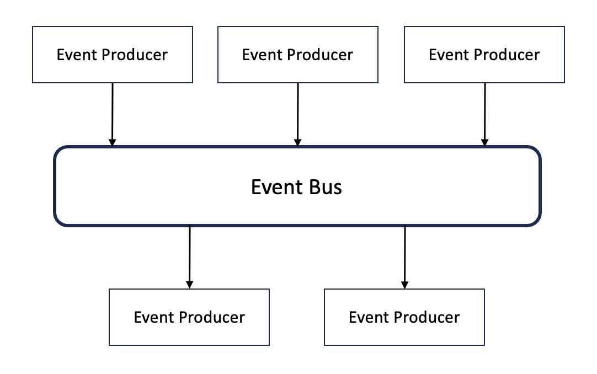

# CH01. 카프카 개요

## I. 이벤트 드리븐 아키텍처 (Even Driven Architecture)

: 분산된 시스템에서 이벤트를 `발행`하고, 발행된 이벤트를 수신자에게 `전송`하는 구조로 수신자는 그 이벤트를 처리하는 방식의 아키텍처

> ### 구성요소

<div align=center>
    
</div>

- `Event Generator`
  - Publisher, Producer, Creater
  - 표준화된 형식의 이벤트 발행
  - 생성된 이벤트를 Event Channel로 전송
- `Event Channel`
  - Bus
  - Event Generator에서 Event Processing Engine으로 수집된 데이터를 전파
  - 이벤트를 필요로 하는 시스템까지 발송
- `Event Processing Engine`
  - Consumer, Processor
  - 수신한 이벤트 식별/처리
  - 처리 결과에 따라 새로운 이벤트를 생성할 수 있음
  - Consumer는 이벤트의 송신자에 대한 정보를 알 필요가 없음

> ### 동기화 방식에서의 한계점

- 다중 노드 환경에서 모든 데이터 변경에 대한 올바른 전달 보장 문제
- 동일 데이터 동시 수정에 대한 순서 보장 및 수정된 이벤트들에 대한 정확한 순서의 아웃바운드 전송 문제
- 다양한 클라이언트들의 요구사항을 효율적으로 지원하기 어려운 문제
- 빠른 전송을 위한 클라이언트 또는 대량의 배치 전송을 위한 클라이언트를 지원하기 어려운 문제

<br>

## II. 비동기 방식의 대표 스트리밍 플랫폼, Kafka

&nbsp; 카프카는 높은 처리량, 순서 보장, 적어도 한번 전송 방식, 강력한 파티셔닝, 자연스러운 백프레셔 핸들링, 로그 컴팩션 같은 훌륭한 기능을 가지고 있다.

> ### i) 빠른 데이터 수집이 가능한 높은 처리량

- 응답시간 → 한 자릿수의 밀리초(ms)
- 더 광범위한 데이터 흐름을 만들 수 있음

> ### ii) 순서 보장

- 이벤트 처리 순서 보장
- 엔티티 간 유효성 검사, 동시 수정 같은 복잡성 제거

> ### iii) 적어도 한번 전송 방식

- 멱등성 보장
- `적어도 한번 전송 방식`을 통해 메시지 손실 문제 해결

> ### iv) 자연스러운 백프레셔 핸들링

- 카프카의 클라이언트 → Pull 방식으로 동작
  - 자기 자신의 속도로 데이터 처리 가능
  - Push 방식은 브로커가 보내주는 속도에 의존함

> ### v) 강력한 파티셔닝

- 효과적인 수평 확장 가능

> ### vi) 이외의 기능

- 로그 컴팩션 → 스냅샷 역할 가능
- 프로듀서와 컨슈머의 완벽한 분리
- 모니터링

<br>

## III. 카프카로 도약의 기회를 얻은 잘란도

&nbsp; kafka 기반의 느슨하게 결합된 이벤트 드리븐 시스템과 애플리케이션들을 구축한 잘란도는 이벤트 스트림을 통해 모든 데이터를 비동기 방식으로 처리하고 있다.

- 자동화된 데이터 중심의 방법론 구현
- 도메인 랭킹 → kafka streams 사용 (맵리듀스 연산 및 실시간 처리 가능)
- 주요 비즈니스 영역의 문제 해결

```
📒 맵리듀스 (MapReduce)
: 흩어져있는 데이터를 수직화하여 종류별로 모으고, 필터핑과 정렬을 거쳐 데이터를
 뽑아내는 분산처리 기능
```

<br>

## IV. 카프카의 주요 특징

- 높은 처리량과 낮은 지연시간
- 높은 확장성
- 고가용성
  - 리플리케이션 기능
- 내구성
  - 프로듀서의 `acks` 옵션 → 메시지의 내구성 강화
  - 모든 메시지가 카프카의 로컬 디스크에 저장
  - 버그 또는 장애 시 재처리 가능
- 개발 편의성
  - 프로듀서와 컨슈머의 완벽한 분리
  - `카프카 커넥트` → 손쉽게 소스와 싱크로 데이터를 보내고 받을 수 있음
  - `스키마 레지스트리` → 데이터 파싱 관련 스키마를 정의해서 사용 가능
- 운영 및 관리 편의성

<br>

## V. 카프카의 성장

> ### **v0.8** → `리플리케이션 기능` 추가

- 브로커의 장애가 발생해도 데이터 유실 없이 안정적으로 사용 가능

> ### **v0.8.2** → `스키마 레지스트리 공개` 공개

- 초기 카프카 → Pub/Sub 모델의 한계 등 문제 발생
  - 비동기 통신만 가능
  - 중앙화 된 브로커 → 처리 지연
  - 한계적인 확장성
  - 메시지 유실 가능
  - 보안
  - 메시지 순서 보장 X
- 스키마 레지스트리 등장
  - 프로듀서와 컨슈머 간 데이터 구조를 설명할 수 있는 스키마 등록 지정 및 사용

> ### v0.9 → `카프카 커넥트` 공개

- 별도의 코드 작성 없이 다양한 프로토콜과 카프카 연동 가능

> ### v0.10

- 실시간 분석 및 처리 제공

> ### KSQL

- SQL 기반으로 실시간 처리 가능

> ### v3.0 → 주키퍼 의존성에서 해방

- 카프카의 토픽, 브로커 등을 관리 목적으로 분산 코디네이터 시스템인 `주키퍼`를 사용함
  - 카프카의 높은 성능을 갖는 데 장벽
- 주키퍼 없이 동작 가능한 카프카 공개
  - 아직은 실제 운영 환경에서 추천하진 않음
